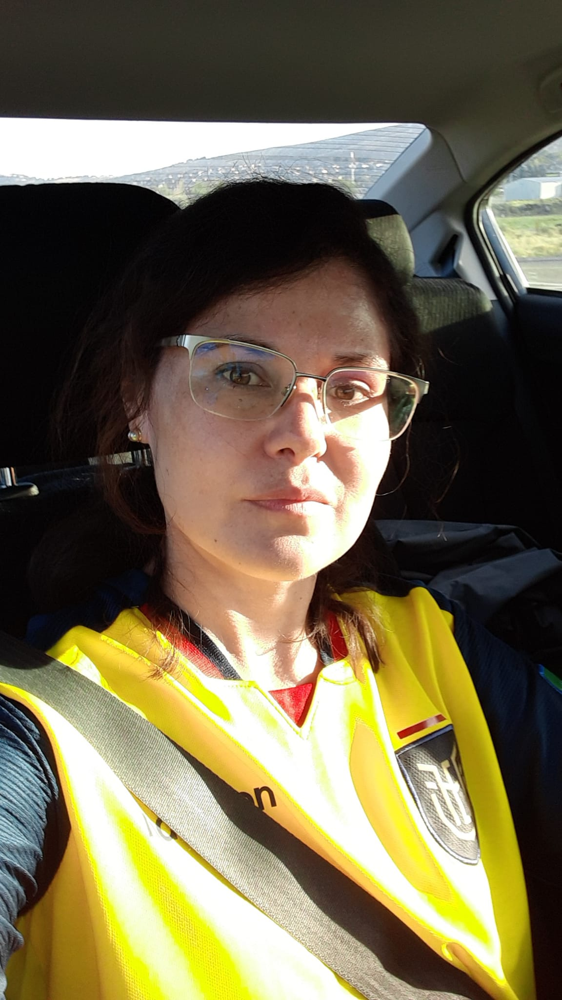

::: {.hero}

Washington State University · AgAID Institute

# Paola Pesantez-Cabrera

Research Assistant Professor — EECS

Paola Pesantez-Cabrera is a Research Assistant Professor in the School of Electrical Engineering and Computer
Science at Washington State University. She is also the data manager/scientist for the AgAID Institute - AI for
Transforming Workforce and Decision Support in Agriculture and the Washington Soil Health Initiative (WaSHI).
Her research focuses on the development of data-driven decision support tools through the application of FAIR data
principles and the use of artificial intelligence and machine learning with a direct impact on agriculture and its
environmental and economic sustainability. She is an avid advocate of accessible education, the generation of knowledge,
respect for diversity and the visualization and engagement of Latin American women in STEM,
which is why she is also a member of Women in Analytics and the Association of Data Scientists.

:::

## Currently

- Preparing presentation for FIRA Spanish session
- Teaching *Generative AI* (tutorials, workshops)
- Exploring AI-Readiness Assessment

## Research areas

::: {.card-grid}

Data Management · Frameworks
Frameworks and practices (FAIR, governance, metadata) that keep research data trustworthy and reusable.
How connectivity structure predicts an ecosystem's ability to absorb disturbance.

Generative AI · Tools for Research
Responsible use of language models for literature review, exploratory analysis, and reproducible code generation.

Workforce Development · Technology Transfer 
Building practical skills and training pathways so research outcomes and new technologies actually reach the people who need to use them.

:::

[See the full research statement →](research.qmd)
